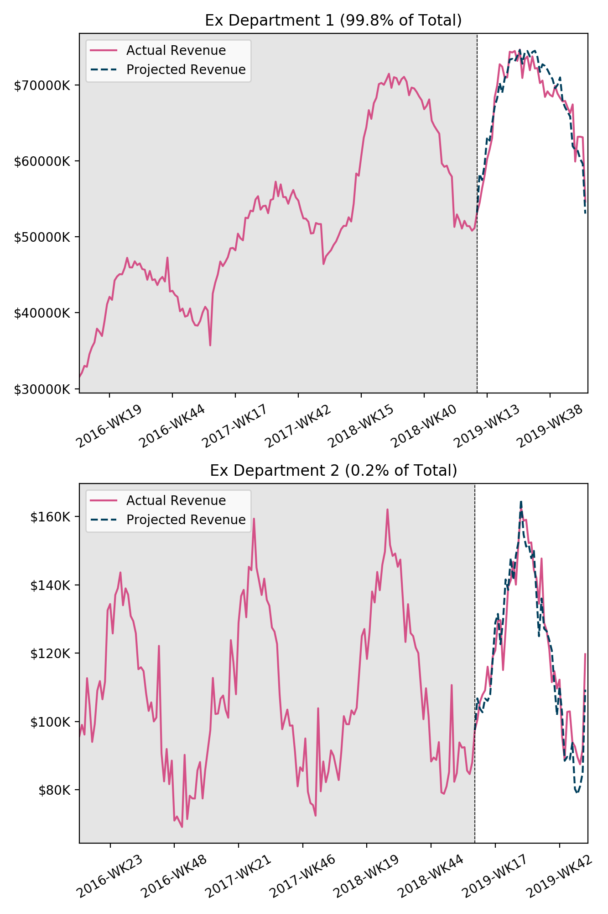
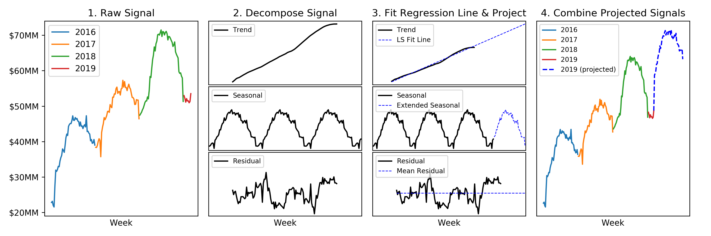
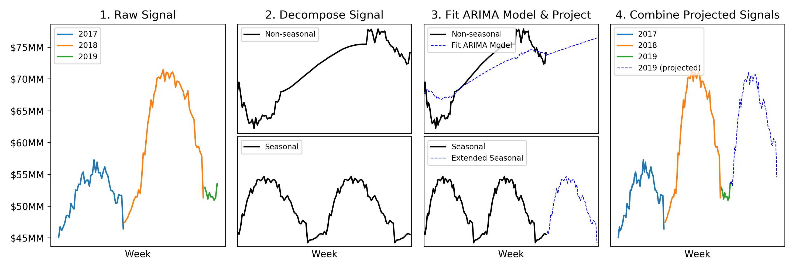
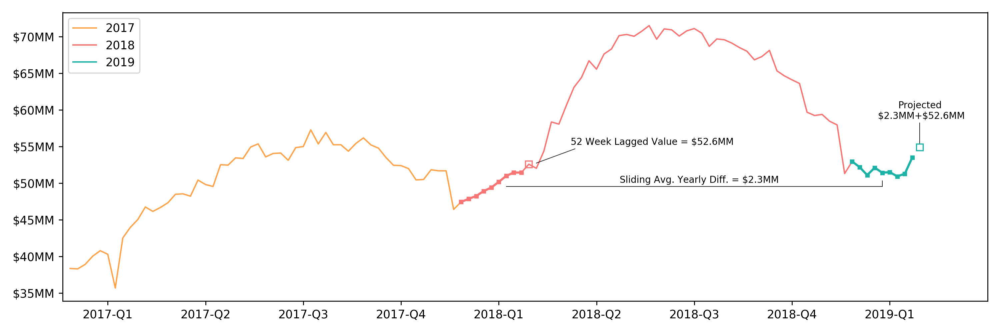

# Time Series Forecasting
We built this repository to help retailers prepare for, and evaluate the impact of, the COVID-19 epidemic. This repository can be used to forecast future timeseries values, and compare these forecasts against observed values to measure the impact-to-date of fleet-wide influences. For more detail on the motivation behind this project, please see https://marketdial.com/covid-19-model/.

The repository consists of python scripts that utilize various methods of forecasting, and a generic excel model that can be used to track and estimate effects at the store, department, and state level.

## 1. Code Usage
The forecast algorithm uses an input CSV in which each row represents the total sales for a given store, on a particular day, at a specified hierarchy level (Grocery/Infant etc.). The CSV must contain three index columns (hierarchy_id, store_id, date_day) followed by any number of tracked metric columns (revenue/units etc.). The date_day must be in YYYY-MM-DD format. The *sample_input_data.csv* illustrates the expected input data format. Along with the input data, the user will specify the year they want to make projections. 

The forecast algorithm will iterate through every store-category pair, make individual weekly projections, and join all the data into a data frame that is saved into the Output folder. The data frame has four index columns: hierarchy, store_id, year, week, and an additional projected column for each metric column in the input file. An example output is given in *Output/2019_projected.csv*.

### 1.1 File descriptions and order of execution.
The first file to be executed is run_forecasts.py. This file will read data from a pre-defined location and, using the forecasting functions it imports from forecasts_methods.py, save two files containing the real and projected metric values into the Output folder. 

You can then optionally run plot_all_forecasts.py which will read the output from run_forecasts.py, iterate through each hierarchy, aggregate the data across all stores, and save plots of the real vs. projected values into the Output folder. 



### 1.2 File parameters.
There are only a few parameters that need to be adjusted within with each script to get started. 

For run_forecasts.py, the user must set:
```
year_start: the year the user wants to make projections for.
week_start: the week where the projections should start (i.e. a value of 10 means that you want to use the first 9 weeks of the year as part of the training data.)
metric_list: This list should contain all the metrics that are present as columns in your data input file (format specified below).
method: selects which of three methods should be used to make the projections. A description of each method is given below.
input_file: file location of the input data.
```

And for plot_all_forecasts.py, the user only needs to set:
```
year_start: same value that was used in run_forecasts.py
week_start: "                                          "
plot_metric: the metric to be plotted.
```


## 2. Methodology Review
### 2.1. Signal-Trend Decomposition and LS Regression
This method works by using pythons built-in decomposition algorithm to split the signal into its trend and seasonal components and then forecasting the components individually. 

The trend is extracted from the signal by computing a running mean with length equal to the expected seasonality (is this case we use a 52-week running average). Once the trend is removed from the original signal, the seasonal component is removed using a convolution filter. What remains after extracting the trend and seasonal components is the raw residuals.

We project future values for the trend using weighted linear regression (we weight the more recent data higher). The seasonal component is projected repetitively. And the residual component is projected using its mean. Finally, the individual components are added back together for our projection of the original signal.



### 2.2. Signal-Trend Decomposition with ARIMA Model


### 2.3. Simple Lagged Yearly Comp Method



## 3. Spreadsheet Scenario Planning
This spreadsheet tabs are colored by their purpose: (1) outputs = green (2) scenario-planning adjustable fields = orange (3) input data = blue.
### 3.1. Add Data
To use this spreadsheet, you will need prediction and actual data on the store-category-week level as produced from the above Python model (run_forecasts.py). The current spreadsheet is built around revenue and units sold metrics but could be updated for any other metrics of interest. Data can be copy and pasted into the "Raw Predictions" and "Actual Values" tabs. Columns for store, week, category and one or two metrics should retain the same ordering as the example spreadsheet.

Store-region information can be added to the "Store State Lookup" tab.

Once the raw data has been updated, the pivot tables in the last 3 tabs should be refreshed.
### 3.2. Adjust Other Fields as Necessary
There are a few fields which will need to be hand-adjusted based on your data. For instance, the number of category columns will need to be adjusted one most of the output and adjustable-value tabs. In addition, one with other metrics may wish to adjust the revenue/units toggle or the tab and column names. Such changes may require adjustments to dependent pivot tables, formulas, etc.

### 3.3. Scenario Planning
The "Adjust Impact by State" tab allows a user to suppose that certain regional effects will be greater than others. The values represent the hypothesized percent increase or decrease from predicted values based on the state alone.

The "Adjust Category Effects" tab allows the user to adjust hypothesized percent increase or decrease from predicted values at the category-week level.
### 3.4. Outputs
These tabs summarize projected effects and effects observed so far using the raw input data and the user-adjusted scenario planning fields. The projected impact can be viewed at an overall or individual store level. The "Impact To-Date" tab summarizes impact observed by comparing predicted vs. actual for available data.
